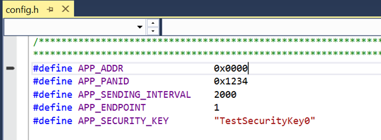

# LIGHTWEIGHT_MESH_STACK

> "Wireless Made Easy!" - Lightweight Mesh Software Stack with source code for self-support, self-maintenance and self-programming

Devices: 802.15.4 TRx and SoCs

## ⚠ Disclaimer

<b>
Subject to your compliance with these terms, you may use Microchip software and any derivatives exclusively with Microchip products. It is your responsibility to comply with third party license terms applicable to your use of third party software (including open source software) that may accompany Microchip software. 
THIS SOFTWARE IS SUPPLIED BY MICROCHIP "AS IS". NO WARRANTIES, WHETHER EXPRESS, IMPLIED OR STATUTORY, APPLY TO THIS SOFTWARE, INCLUDING ANY IMPLIED WARRANTIES OF NON-INFRINGEMENT, MERCHANTABILITY, AND FITNESS FOR A PARTICULAR PURPOSE. 
IN NO EVENT WILL MICROCHIP BE LIABLE FOR ANY INDIRECT, SPECIAL, PUNITIVE, INCIDENTAL OR CONSEQUENTIAL LOSS, DAMAGE, COST OR EXPENSE OF ANY KIND WHATSOEVER RELATED TO THE SOFTWARE, HOWEVER CAUSED, EVEN IF MICROCHIP HAS BEEN ADVISED OF THE POSSIBILITY OR THE DAMAGES ARE FORESEEABLE. TO THE FULLEST EXTENT ALLOWED BY LAW, MICROCHIP'S TOTAL LIABILITY ON ALL CLAIMS IN ANY WAY RELATED TO THIS SOFTWARE WILL NOT EXCEED THE AMOUNT OF FEES, IF ANY, THAT YOU HAVE PAID DIRECTLY TO MICROCHIP FOR THIS SOFTWARE.

</b>

> Interact with your peers about this software in [802.15.4 Forum](https://www.microchip.com/forums/f546.aspx).

## Important considerations

<b>THE SOFTWARE ARE PROVIDED "AS IS" AND GIVE A PATH FOR SELF-SUPPORT AND SELF-MAINTENANCE.

This repository contains unsupported example code intended to help accelerate client product development. It is not validated for production nor audited for security best-practices. Note that while this repository is unsupported, Microchip welcome community contributions, and all pull-requests will be considered for inclusion into the repository.
</b>

## Resources

- [Lightweight Mesh Landing page](https://www.microchip.com/en-us/development-tool/ATMEL-LIGHTWEIGHT-MESH)
- [Microchip Studio 7.0 IDE](https://www.microchip.com/mplab/microchip-studio)
- [AVR2130: Lightweight Mesh Developer Guide](https://ww1.microchip.com/downloads/en/Appnotes/Atmel-42028-Lightweight-Mesh-Developer-Guide_Application-Note_AVR2130.pdf)
- [AVR2131: Lightweight Mesh Getting Started Guide Application Note](http://ww1.microchip.com/downloads/en/Appnotes/Atmel-42029-Lightweight-Mesh-Getting-Started-Guide_Application-Note_AVR2131.pdf)

## A la carte

1. [Introduction](#step1)
1. [Hardware Platforms](#step2)
1. [Software Requirements](#step3)
1. [Software Environment Setup](#step4)
   1. [Overview](#step4a)
   1. [Location of MakeFiles in LWMESH Folder Structure](#step4b)
   1. [Create a project from Makefile in Microchip Studio 7](#step4c)
1. [Sample Applications](#step5)
   1. [Energy Detection Application](#step5a)
   1. [Peer2Peer Application](#step5b)
   1. [Tester Application](#step5c)
   1. [WSN Demo Application](#step5d)

## Introduction

Lightweight Mesh software stack is an easy to use proprietary low power wireless mesh network protocol. It has been designed to address the needs of a wide range of wireless connectivity applications, including:
- Remote control
- Alarms and security
- Automatic Meter Reading (AMR)
- Home and commercial building automation
- Toys and educational equipment

Lightweight Mesh is designed to work with all Microchip IEEE® 802.15.4 transceivers and SoCs. Currently the stack works with AVR®- and ARM®-based MCUs, but given extreme portability and low resource requirements, it can be run on almost any Microchip MCU.

## Hardware Platforms

| Supported MCU families | Supported Transceivers | Supported boards |
| --- | --- | --- |
| <b>SAM platforms</b> | AT86RF212 | Atmega256RFR2 Xplained Pro |
| SAMD20 | AT86RF12B | SAMR21 Xplained Pro |
| SAMD21 | AT86RF231 | SAM4S Xplained Pro |
| SAM4L | AT86RF233 | SAM4L Xplained ProUSB stick with ZigBit Xmega-AT86RF233 |
| SAMR21 |	ATMEGARFA1 |	USB stick with ZigBit Xmega-AT86RF212B |
| SAM4S |	ATMEGARFR2 |	SAMD20 with ZigBit AT86RF233 |
| SAM4E | | SAMD20 with ZigBit-AT86RF212B |
| MEGA_RF |  | SAM4L with ZigBit AT86RF233 |
| Atmel AVR 8-bit ATmega RF Single Chip platforms | | SAM4L with ZigBit-AT86RF212B |
| XMEGA-A | |  Xmega-a3bu Xplained with RZ600 radio modules |
| Atmel AVR 8-bit ATxmega platforms | |  Atmega128rfa1 RCB |
| | |  Atmega256rfr2 RCB |

## Software Requirements

* [Microchip Studio 7.0 IDE](https://www.microchip.com/mplab/microchip-studio)
* [Advanced Software Framework ASFv3.50](https://www.microchip.com/en-us/development-tools-tools-and-software/libraries-code-examples-and-more/advanced-software-framework-for-sam-devices)
* [WSN Monitor](https://gallery.microchip.com/packages/WSN-Monitor-Setup/)
* LwMesh stack v1.2.1 ([Clone/Download](https://docs.github.com/en/free-pro-team@latest/github/creating-cloning-and-archiving-repositories/cloning-a-repository) the current repo to get the software)

Notes: The Lighweight Mesh software is validated with Microchip Studio 7.0, ASFv3.50 on [SAMR21 Xplained Pro](https://www.microchip.com/en-us/development-tool/ATSAMR21-XPRO) boards

## Software Environment Setup

### Overview

Makefiles have been generated for each hardware supported.

Follow the instructions below to learn how to access the makefile location and generate a Microchip Studio project from a makefile.

### Location of MakeFiles in LWMESH Folder Structure

Generic File Path:
`..\thirdparty\wireless\avr2130_lwmesh\apps\AppName\Device_Name\gcc`

or

Device Specific File Path:
`..\thirdparty\wireless\avr2130_lwmesh\apps\EdDemo\atmega128rfa1_rcb\gcc`

Inside the gcc folder MakeFile can be found.

### Create a project from Makefile in Microchip Studio 7

To create a project from Makefile in Microchip Studio 7:

https://microchipsupport.force.com/s/article/Creating-a-project-from-Makefile-in-Atmel-Studio

Alternatively, to open the readily available Microchip studio C project file, find it from the mentioned path:

Generic File Path:
`..\thirdparty\wireless\avr2130_lwmesh\apps\AppName\Device_Name\as5_8`

or

Device Specific File Path:
`..\thirdparty\wireless\avr2130_lwmesh\apps\EdDemo\atmega128rfa1_rcb\as5_8`

Which can be opened with Microchip studio and changes can be done on the application level if needed and then compiled & build. After the successful build, the firmware images will be generated.

## Sample Applications

### Energy Detection Application

#### Overview

- The Lightweight Mesh EDDemo application demonstrates the energy detection (ED) feature of Microchip 802.15.4 Transceivers and helps analyzing the energy on all channels.

- This application requires only one node for demonstration.

- No Data communication is performed in this application and no networking APIs are used.

- A terminal (9600 8 N 1) need to be connected to the node.

- The node measures the energy values on channels 11 to 26 periodically and prints the results on the connected terminal.

#### Output

### Peer2Peer Application

#### Overview

- The Lightweight Mesh Peer2Peer implements a wireless UART application. Two nodes are used in this application.

- These two nodes must be configured with addresses 0x0001 and 0x0000 respectively.

- To test this application, open a terminal for both the nodes. On entering text in the terminal, the data is transmitted from one Node to another node (0x0001 to 0x0000 and vice-versa).

- A terminal (9600 8 N 1) need to be connected to each of the 2 nodes.

#### Nodes Configuration

- Open `config.h` file in Peer2Peer project and Address must be set to 0 for the first device, and to 1 for the second one.

#### Output

### Tester Application

#### Overview

The Test application exposes all stack APIs via serial port and was primarily designed to be used as an automated test tool.

- The operations are illustrated in `tester.c` by the function `appUartSendCommand()`.
- Frame is formatted like this: <1 byte start symbol = 0xa5> <2 bytes size> <2 bytes CRC>.
- Commands and their structure are described in the `commands.h` file.

### WSN Demo Application

#### Overview

The WSN Demo application implements a typical wireless sensor network scenario, in which one central node collects the data from a network of sensors and passes this data over a serial connection for further processing. In the case of the WSN Demo, this processing is performed by the WSN Monitor PC application.

- Device types (Coordinator, Router and End Device) are simulated on the application level; there is no such separation in Lightweight Mesh on the stack level

- The value of the extended address field is set equal to the value of the short address field

- For all frames, the LQI and RSSI fields are filled in by the coordinator with the values of LQI and RSSI from the received frame. This means that nodes that are not connected to the coordinator directly will have the same values as the last node on the route to the coordinator

- Sensor data values are generated randomly on all platforms

- Sending data to the nodes on the network is not implemented and not supported in this demo application

- This demo has been tested with 3 SAM R21 devices

#### Nodes Configuration

The Application Address (`APP_ADDR`) should be set in `config.h`.

- If `APP_ADDR` is 0, the device role will be identified as Coordinator in WSN monitor
- If `APP_ADDR` is less than 0x8000, the device role will be identified as Router
- If `APP_ADDR` is greater than or equal to 0x8000, the device role will be identified as End Device

Coordinator:
- Set `APP_ADDR` = 0x0000

Router:
- Set `APP_ADDR` = 0x0100

End Device:
- Set `APP_ADDR` = 0x8001

#### Output

Network topology in WSN Monitor for 3 devices configured with different device roles in application level.

> Note: For details on LwMesh Architecture & Network Layer specifications, please refer the document [AVR2130_LWMesh_Developer_Guide_v1.2.1](https://ww1.microchip.com/downloads/en/Appnotes/Atmel-42028-Lightweight-Mesh-Developer-Guide_Application-Note_AVR2130.pdf)
